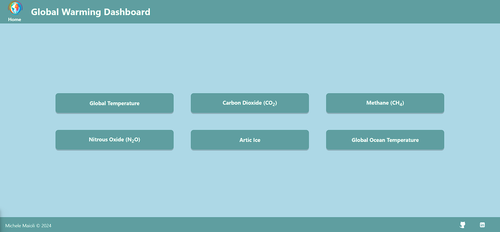

# Global Warming Dashboard

Thank to this dashboard you can check all the principal indicator of the global warming, using the [Global Warming and Climate Change APIs](https://global-warming.org/). [Try the dashboard here!](url)

## Built With

- [JavaScript](https://developer.mozilla.org/en-US/docs/Web/JavaScript)
- [HTML](https://developer.mozilla.org/en-US/docs/Web/HTML)
- [CSS](https://developer.mozilla.org/en-US/docs/Web/CSS)
- [Webpack](https://webpack.js.org/)
- [React](https://reactjs.org/)
- [Recharts](https://recharts.org/en-US/)

## Author

- [Linkedin](https://www.linkedin.com/in/michelemaioli)
- [Website](https://mic-9.github.io/)

## License

This project is licensed under the [MIT](https://choosealicense.com/licenses/mit/)
